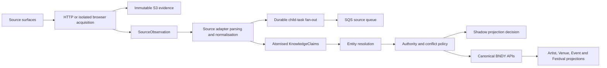

# Backline source ingestion blueprint

**Status:** Living technical handover and implementation blueprint  
**Updated:** 26 August 2026  
**Primary runtime:** `flowency-live/bndy-enrichment`  
**First national source:** Lemonrock  
**Next source candidate:** [On The Case Music](https://onthecasemusic.co.uk/)

## 1. Purpose

This document records what has been built for Lemonrock, why it was built this way, how it operates in AWS, and how to reuse the same architecture for the next source.

The target is not a collection of scrapers that write directly into BNDY. The target is a durable intelligence layer in which each source contributes evidence and atomised claims. Backline resolves source-native identities, retains agreement and disagreement, applies explicit authority policy, and only then projects a best-supported view through canonical BNDY APIs.

The operating principle is:

> Ingest broadly into Backline. Resolve explicitly. Project selectively into canonical BNDY.

This preserves useful but uncertain source data without either discarding it or turning it into an unsafe public duplicate.

## 2. Current production position

### Canonical BNDY baseline

The existing canonical corpus has been represented in Backline successfully under snapshot `bndy-baseline-2026-08-24-v1`:

| Type | Logical entities | Observations | Resolutions | Evidence |
|---|---:|---:|---:|---:|
| Artists | 3,229 | 3,229 | 3,229 | 3,229 |
| Venues | 3,199 | 3,199 | 3,199 | 3,199 |
| Events | 8,844 | 8,844 | 8,844 | 8,844 |
| Festivals | 16 | 16 | 16 | 16 |
| **Total** | **15,288** | **15,288** | **15,288** | **15,288** |

The snapshot contains 518,131 Claims, 11,911 recoverable-source provenance records, 3,377 `BNDY legacy-canonical` provenance records, no skipped records without IDs, and no recorded errors. It ran with `shadow: true` and canonical writes disabled.

### Lemonrock

The national source family, schedules, recovery controls and read-only completion monitoring are deployed. The current recovery run remains in progress at the time of this update. Backline must not declare Lemonrock complete until the final reconciliation manifest proves all of the following together:

- every required discovery branch was observed;
- every advertised directory control is present;
- every discovered logical task is in a valid terminal state;
- the source queue and DLQ are both empty for two stable readings;
- artist, venue and future-gig inventory controls reconcile without unexplained gaps;
- the recurring fast, daily and weekly schedules are enabled;
- `shadow` remains true and canonical writes remain disabled.

The last pre-recovery manifest recorded 10,535 artist identities, 8,291 venue identities and 7,706 gig identities discovered. It also recorded 736 failed logical tasks and 5,124 DLQ messages. Those failures are being replayed through the rate-safe recovery path, so these are a recovery baseline, not final completion counts. The authoritative final figures must come from `ops/lemonrock-reconciliation-manifest.json` after the drain monitor succeeds.

## 3. System model



Backline has two different forms of truth:

1. **Durable knowledge truth:** immutable evidence, Observations, Claims, Resolutions, Tombstones and projection decisions.
2. **Current product truth:** canonical Artist, Venue, Event and Festival records exposed by BNDY APIs.

The second is a materialised projection of the first. A future Neptune graph may index or project the knowledge relationships, but it is not intended to replace DynamoDB and S3 as the durable authority. This is established in [ADR-108](adr/ADR-108-durable-knowledge-substrate.md).

## 4. AWS runtime

`BndyEnrichmentStack` provides the shared runtime:

- one retained, point-in-time-recoverable DynamoDB StateTable;
- one private, retained S3 EvidenceBucket;
- standard and browser source queues, each with a 14-day DLQ;
- a ProjectionQueue and ProjectionWorker;
- a Source Registry and due-source dispatcher;
- EventBridge rules for scheduled work;
- standard HTTP and isolated Chromium workers;
- Lambda handlers with partial SQS batch failure reporting.

The StateTable contains several logical record families rather than one table per concept:

- `SOURCE#...` configuration and runtime state;
- `OBS#<observationId> / META` SourceObservations;
- `CLAIM#<claimId> / META` KnowledgeClaims;
- `RESOLUTION#<candidateType>#<candidateKey> / META` EntityResolutions;
- `BOOTSTRAP#<sourceFamily> / TASK#<taskKey>` durable discovery tasks;
- canonical support links, Tombstones and projection state;
- `BASELINE#<snapshotId> / META` baseline manifests.

The table has GSIs for due-source scheduling, Claims by Observation, and Claims by subject. Claim payloads are stored once and reached through indexes or lightweight support links.

Raw source evidence is written to S3 with `IfNoneMatch: '*'`. This makes the evidence write-once. Run artefacts are also immutable and include:

- `normalised.json`;
- `diff.json`;
- `parity.json`;
- `run-report.json`.

See [the CDK stack](../lib/bndy-enrichment-stack.ts), [ObservationStore](../src/knowledge/stores/observation-store.ts), [ClaimStore](../src/knowledge/stores/claim-store.ts) and [the source run artefact store](../src/sources/runner/storage.ts).

## 5. Generic source contract

Source-specific behaviour sits behind `SourceAdapter`:

```ts
interface SourceAdapter {
  fetch(config, run, acquisition): Promise<FetchedSource>;
  parse(config, run, raw): Promise<ParsedSource>;
}
```

The adapter owns source URL validation, acquisition choices, structural gates, DOM/HTML parsing, native identity extraction and source-specific fan-out. The generic Source Runner owns:

1. loading Source Registry configuration;
2. fetching and parsing the source;
3. storing immutable evidence and its Observation;
4. converting normalised entities/events into Claims;
5. publishing idempotent child tasks;
6. writing the normalised snapshot;
7. diffing it against the correct previous baseline;
8. writing parity and run reports;
9. producing projection work;
10. updating source health/state.

This boundary is the main reusable asset. A new source should add an adapter and source-family configuration, not a new orchestration stack.

## 6. Knowledge records

### SourceObservation

A SourceObservation describes what Backline actually acquired. It records the source, timestamp, URL, evidence hash/key, enumeration method, HTTP/content metadata, structural fingerprint, item counts and completeness flags.

An Observation does not assert that the source is correct. It establishes that Backline saw a specific immutable payload at a specific time.

### KnowledgeClaim

A Claim is one subject-predicate-value assertion with confidence, observation provenance and evidence pointers. Examples include:

- artist candidate `hasName` "The Torrists";
- venue candidate `hasAddress` an observed address;
- event candidate `occursOn` `2026-09-12`;
- event candidate `startsAt` `21:00`;
- event candidate `hasStatus` `cancelled`.

Claims retain disagreements. A new Claim does not overwrite an older source's assertion.

### Source-native candidates and resolutions

Source identities exist independently of canonical BNDY IDs. A candidate may be unresolved, resolved to a canonical entity, or treated as conflicted. The resolution record preserves the decision and supporting Claims.

This is essential for safe multi-source ingestion: evidence can accumulate before BNDY has enough confidence to merge or create anything publicly.

### Projection and authority

Projection work is idempotent. The worker materialises a candidate from Claims, applies source authority and owner-protection rules, and writes only through canonical APIs with read-back verification.

In shadow mode the same work is evaluated and recorded as `wouldWrite`, but no mutation API is called. Lower-authority aggregator evidence cannot silently mutate or delete owner-managed data. Explicit cancellations and complete-snapshot withdrawals are different operations; disappearance from an incomplete or incremental capture is never treated as cancellation.

The current deterministic authority policy ranks owner, artist/venue-owned, official ticket, curated, aggregator and capture sources, with predicate-specific adjustments. See [AuthorityPolicy](../src/projection/authority-policy.ts) and [the projection engine](../src/projection/engine.ts).

## 7. Lemonrock source family

Lemonrock is implemented as a family of explicit jobs rather than one monolithic scrape:

| Source ID | Responsibility |
|---|---|
| `lemonrock-new-gigs` | Fast discovery of newly posted gigs |
| `lemonrock-cancellations` | Explicit cancellation evidence |
| `lemonrock-artist-index` | National artist directory discovery and controls |
| `lemonrock-venue-index` | National venue directory discovery and controls |
| `lemonrock-artist-hydration` | Rich artist profile evidence |
| `lemonrock-venue-hydration` | Rich venue profile evidence |
| `lemonrock-gig-hydration` | Individual gig details and relationships |
| `lemonrock-future-reconcile` | County/national future-gig completeness |
| `lemonrock-full-reconcile` | Root fan-out for the full national sweep |

All are configured as aggregator-class, standard HTTP, AWS-owned writers, enabled and shadowed. Auto-match/create thresholds are deliberately high.

### Discovery and fan-out

The full reconcile fans out to the artist directory, venue directory, future-gig index and fast-change surface. Index pages produce child tasks for profiles, gig pages, pagination/directory pages and inventory controls.

Each child task is first written durably under `BOOTSTRAP#lemonrock`. Only after the conditional DynamoDB write succeeds is the SQS message published. If SQS publication fails, the new task row is removed so it can be retried safely.

Task records distinguish:

- the physical dedupe key;
- the stable `logicalTaskKey` used for completion accounting;
- task kind and source ID;
- queued, running, completed or failed status;
- source URL and source-specific payload;
- reconciliation ID and timestamps;
- the latest classified error.

### Idempotency and refresh windows

The fan-out policy balances dedupe with freshness:

- gig detail tasks can refresh hourly, so same-day changes/cancellations are not hidden;
- artist and venue profiles hydrate at most once per ISO week during discovery;
- directory/county discovery tasks replay daily;
- discovery keys include schema version `v4`, so a parser/discovery change can intentionally replay the logical inventory;
- a reconciliation ID scopes a national pass while duplicate paths to the same identity collapse.

Completion reports deduplicate by logical identity. A source page reached through several branches is therefore one completeness obligation, not several misleading task rows.

### Native identities

Stable source-native keys prevent name-only identity collapse:

```text
lemonrock:artist:<profile-slug>
lemonrock:venue:<profile-slug>
lemonrock:gig:<numeric-gig-id>
```

Gig Claims link the source-native performer and venue identities where the page exposes them.

### Extracted data

The Lemonrock adapter currently extracts:

- artists: name, location, artist/act type, genres, biography, social/website links, phone/email and source metadata where present;
- venues: name, venue type, address/postcode, biography/description, social/website links, phone/email and source metadata where present;
- gigs: source ID/URL, artist, venue, date, start/end time, title, admission/price, status, posting provenance and cancellation evidence.

Fields that do not yet have a first-class predicate are retained as structured `derivedFrom` Claims. This is intentional capture-before-prune behaviour, not a signal to write them directly into a canonical record.

### Acquisition resilience

Lemonrock intermittently resets bursty AWS-origin traffic. The deployed protection is deliberately conservative:

- standard worker reserved concurrency: 2;
- SQS event-source maximum concurrency: 2;
- batch size: 1;
- 300 to 800 ms initial random jitter;
- up to eight bounded attempts;
- retry only for fetch/network and HTTP 403, 408, 425, 429 and 5xx classes;
- exponential backoff capped at 12 seconds plus up to one second jitter;
- DLQ redrive at one message per second during recovery.

Retries do not relax parsing or completeness gates. A recognisable HTML structure is required before parsing.

### Inventory controls

Completeness cannot be inferred from a large evidence count. Lemonrock directory pages create explicit control tasks containing the source-advertised count. Where a title omits that count, the implementation falls back to the number of parsed unique profile links and records which count source was used.

The completion manifest compares:

- advertised artists with unique discovered artist identities;
- advertised venues with unique discovered venue identities;
- advertised future gigs with unique discovered gig identities;
- expected directory pages/controls with completed controls;
- required source branches with observed branches;
- logical tasks by terminal status;
- main queue and DLQ depth.

This is the pattern the next source must copy: source-specific, independently checkable controls rather than a generic "workflow succeeded" flag.

### Schedules

The deployed Lemonrock schedules are:

- new gigs and cancellations: every 15 minutes;
- future gigs plus artist and venue indexes: daily at 02:10 UTC;
- full national directory reconciliation: Sundays at 02:20 UTC.

The Source Registry remains the canonical source configuration model. Direct EventBridge rules are durable launchers for this national family, not a competing store of source truth.

## 8. Failure recovery and completion ownership

The initial national run found that high fan-out concurrency could trigger remote resets and push retryable tasks into the DLQ. Recovery therefore changed the production runtime and replay method rather than launching another uncontrolled national sweep.

The recovery sequence is:

1. deploy bounded concurrency and retry/backoff;
2. repair the missing directory discovery/control coverage;
3. redrive the existing DLQ slowly;
4. let the queue drain through the corrected runtime;
5. require two stable zero readings for queue and DLQ;
6. generate and commit a sanitised final manifest;
7. declare completion only if every inventory and task gate passes.

No recovery workflow enables canonical writes. No completion check treats a successful GitHub Actions run as proof by itself; the manifest is calculated from live AWS state.

Operational references:

- [national ingestion plan](LEMONROCK-NATIONAL-INGESTION.md);
- [latest sanitised live audit](backline-live-audit.json);
- [latest reconciliation manifest](../ops/lemonrock-reconciliation-manifest.json);
- [drain monitor workflow](../.github/workflows/lemonrock-drain-monitor.yml).

## 9. Canonical BNDY baseline lane

The canonical baseline is a separate one-shot source lane. It reads `bndy-artists`, `bndy-venues` and `bndy-events`, splitting festival records logically, then emits a Backline representation with preserved canonical IDs.

Each canonical item receives:

- one logical source-native entity;
- an Observation and immutable evidence object;
- atomised Claims describing the current record;
- an EntityResolution back to the same canonical ID;
- explicit provenance classified as recoverable source or `BNDY legacy-canonical`.

The manifest at `BASELINE#<snapshotId> / META` is the authoritative completion receipt. This lane is important for later comparison: external-source Claims can be evaluated against the current BNDY corpus without first projecting or overwriting it.

## 10. Reusable implementation sequence for a new source

Every new source should follow the same controlled sequence.

### Phase A: source contract and reconnaissance

1. Identify every authoritative source surface, its native IDs and its update semantics.
2. Determine whether global indexes are complete or merely recent/filtered views.
3. Record pagination, locale/timezone, cancellation semantics, prices, recurring events and detail-page relationships.
4. Choose standard HTTP unless the page demonstrably requires JavaScript/browser acquisition.
5. Define independent completeness controls before running a production bootstrap.
6. Classify the source's authority by predicate. A promoter may be strong for gigs it promotes but not authoritative for an artist's identity or biography.

### Phase B: adapter and fixtures

1. Create `src/sources/adapters/<source>/`.
2. Add representative saved fixtures for indexes, profiles, gigs, cancellations, empty states and structural changes.
3. Implement strict host allow-listing and structural gates.
4. Extract stable native IDs, not name-derived IDs when source IDs exist.
5. Preserve raw source fields as first-class or `derivedFrom` Claims.
6. Emit deterministic child tasks and warnings for partial records.
7. Add golden parser and fan-out tests.

### Phase C: source family and execution controls

1. Add separate discovery, hydration, cancellation and full-reconcile source IDs where the surfaces have different semantics.
2. Seed Source Registry entries disabled, shadowed and non-writing.
3. Set source-specific concurrency, retry and cadence limits.
4. Use logical task keys and schema-versioned dedupe windows.
5. Build a sanitised completion manifest from live AWS state.

### Phase D: shadow bootstrap

1. Deploy the adapter and source records.
2. Run a bounded bootstrap.
3. Monitor queue, DLQ, task terminal state, structural warnings and source health.
4. Repair and idempotently replay failures.
5. Run a full reconciliation after the bootstrap.
6. Repeat until every source-specific completeness control passes.

### Phase E: resolution and inspection

1. Classify each source-native artist, venue and gig identity as resolved, unresolved or conflicted.
2. Expose bounded graph traversal in Godmode from Source to Observation to Claim to source identity to canonical entity.
3. Show conflicts, authority decisions, evidence and projection outcomes.
4. Produce shadow comparisons against the canonical baseline.

### Phase F: controlled projection

Projection is a separate decision. Start with a bounded, high-confidence cohort and explicit stop thresholds. Keep owner protection, canonical API dedupe and read-back verification active. Never switch on a second live writer for the same source.

## 11. On The Case Music initial source assessment

This assessment is a starting contract, not proof of production completeness.

### Observed public surfaces

- [Gigs](https://onthecasemusic.co.uk/gigs) exposes a server-rendered future listing with date, artist, venue, venue contact/location, time and price/free status.
- [Venues](https://onthecasemusic.co.uk/venues) exposes a grouped directory. Detail URLs use `/venues/<numeric-id>/<slug>` and profiles can contain address, postcode, phone, links, opening hours, capacity, accessibility, food, description and future gigs.
- [Bands](https://onthecasemusic.co.uk/bands) exposes a band directory. Detail URLs use `/bands/<numeric-id>/<slug>` and profiles can contain name, raw genres, description, social links and future gigs.
- The navigation exposes a cancellations surface. Its exact response and empty-state semantics must be captured in fixtures before implementation.
- Gig detail URLs observed under venue routes contain a stable numeric event ID, for example `/venues/<venue-id>/<venue-slug>/<event-id>`.

The global Gigs, Venues and Bands pages currently appear server rendered. The existing seed marks On The Case as a browser source, but reconnaissance should prove whether that remains necessary. Standard HTTP should be preferred if it returns the complete DOM consistently.

### Proposed source family

```text
onthecase-full-reconcile
onthecase-band-index
onthecase-venue-index
onthecase-gig-index
onthecase-cancellations
onthecase-band-hydration
onthecase-venue-hydration
onthecase-gig-hydration
```

The old `onthecase-daily-import` registry seed can be migrated or retained temporarily as a disabled compatibility record. It must not remain a competing execution path once the source family is active.

### Proposed native identities

```text
onthecase:band:<numeric-id>
onthecase:venue:<numeric-id>
onthecase:gig:<numeric-event-id>
```

Preserve the source's term `band` in its native key while mapping the candidate entity type to Backline `artist`.

### Authority and data handling

On The Case is a booking agency/promoter. Treat it as strong evidence for gigs it promotes, including date, venue, time, admission and cancellation where explicit. Treat profile biography, genre and venue metadata as useful source Claims, not automatic ownership authority.

Raw source genres should be preserved exactly. Any mapping to BNDY's controlled genre taxonomy must be a separate, provenance-bearing interpretation rather than destructive normalisation.

### Completeness controls

The first implementation should count and reconcile:

- unique numeric band profile IDs on `/bands`;
- unique numeric venue profile IDs on `/venues`;
- unique numeric event IDs on `/gigs`;
- every discovered profile/detail hydration task;
- any location/index subdivisions as cross-checks, not automatically as the completeness root;
- the cancellations branch even when it is empty;
- pagination or load-more controls if present;
- logical tasks by terminal state;
- main queue and DLQ at stable zero;
- a second full reconciliation with no unexplained missing identities.

The parser should fail closed if pagination or rendering behaviour changes. A zero-item response from a historically non-empty surface is a health warning, not an authoritative empty snapshot.

### Candidate cadence

- gigs and cancellations: every 15 to 30 minutes;
- band and venue indexes: daily;
- full reconciliation: weekly.

These are candidate cadences to confirm against actual update behaviour and source load. Do not enable them until fixture parity, bounded live acquisition and completion reporting are proven.

### On The Case definition of done

On The Case is ready for the resolution/graph stage only when:

1. all public source surfaces and native identity shapes are documented;
2. adapter fixtures and structural gates pass;
3. the source family runs in AWS with `shadow: true` and canonical writes disabled;
4. a bootstrap and subsequent full reconciliation both complete;
5. inventory controls reconcile and queues/DLQs are stably empty;
6. artist, venue and gig Claims retain evidence links and source-native relationships;
7. recurring schedules run successfully;
8. Godmode can inspect its source identities alongside Lemonrock and the canonical BNDY baseline.

## 12. Immediate execution plan

1. **Close Lemonrock completion:** allow the current rate-safe recovery to drain, publish the final live manifest, and repair only evidence-backed residual gaps.
2. **Persist Lemonrock resolutions:** produce explicit resolved, unresolved and conflicted states against the canonical baseline.
3. **Build the Godmode graph view:** add bounded read-only traversal over Sources, Observations, Claims, source-native identities, Resolutions, canonical entities and projection decisions.
4. **Start On The Case reconnaissance:** capture live fixtures, prove HTTP versus browser acquisition, define cancellation and completeness semantics, and confirm source load limits.
5. **Implement the On The Case adapter/source family:** reuse the generic runner, task, evidence, Claim and manifest machinery.
6. **Run On The Case in shadow:** bootstrap, reconcile, repair and prove recurring diffs before any projection decision.
7. **Compare intelligence to canonical BNDY:** use the canonical baseline and multiple sources to surface corroboration, conflicts, missing records and high-confidence additions.

## 13. Non-negotiable controls

- Live AWS state, not workflow conclusions or committed plans, is the source of truth for production completion.
- Raw evidence and historical Claims are immutable.
- No source writes directly to canonical DynamoDB tables.
- Canonical mutations go through BNDY APIs with read-back verification.
- `shadow: true` and canonical writes disabled are the default for a new external source.
- Absence is not cancellation unless a complete authoritative snapshot or explicit cancellation semantics prove it.
- Owner-managed records are protected from lower-authority automated mutation.
- Source-native IDs are preserved even when resolution is uncertain.
- A large item count is not completeness. Every source needs explicit inventory controls and a final live manifest.
- Recovery replays failed logical work; it does not launch repeated uncontrolled national bootstraps.
- Graph databases and graph visualisations are derived views over the durable evidence substrate.

## 14. Key code and architecture references

- [Target architecture](TARGET-ARCHITECTURE.md)
- [Build plan](BUILD-PLAN.md)
- [Lemonrock national ingestion plan](LEMONROCK-NATIONAL-INGESTION.md)
- [Intelligence graph](INTELLIGENCE-GRAPH.md)
- [Durable knowledge substrate ADR](adr/ADR-108-durable-knowledge-substrate.md)
- [Source Registry ownership ADR](adr/ADR-110-source-registry-ownership.md)
- [Generic SourceAdapter](../src/sources/runner/adapter.ts)
- [Generic Source Runner](../src/sources/runner/runner.ts)
- [Durable fan-out and dedupe](../src/sources/runner/fanout.ts)
- [Knowledge construction](../src/sources/runner/knowledge.ts)
- [Lemonrock source definitions](../src/sources/adapters/lemonrock/sources.ts)
- [Lemonrock acquisition adapter](../src/sources/adapters/lemonrock/index.ts)
- [Lemonrock parser and fan-out](../src/sources/adapters/lemonrock/parse.ts)
- [Projection engine](../src/projection/engine.ts)
- [Authority policy](../src/projection/authority-policy.ts)
- [AWS/CDK stack](../lib/bndy-enrichment-stack.ts)

