# BNDY Intelligence Layer & Knowledge Graph — Visual Architecture

**Status:** Visual companion to `docs/TARGET-ARCHITECTURE.md`  
**Date:** 20 August 2026  
**Authority:** `docs/TARGET-ARCHITECTURE.md` remains the single authoritative target architecture. If this visual companion conflicts with it, `TARGET-ARCHITECTURE.md` wins.

---

## 1. The one-picture view

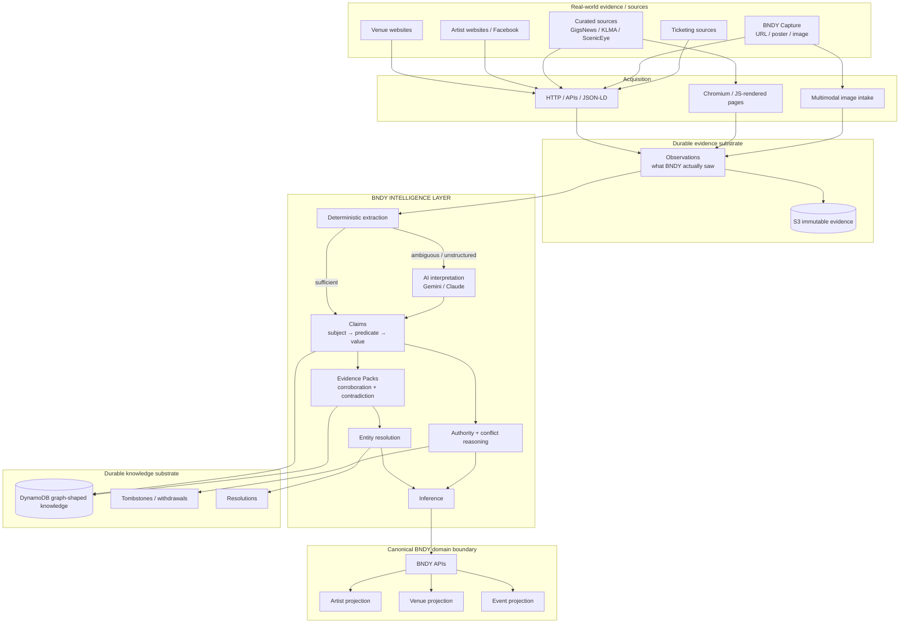

The key architectural line is:

> **AI does not own truth. AI helps convert messy evidence into Claims and helps reason across them. The durable knowledge substrate remembers what was seen, what was inferred, who asserted it and why the current BNDY projection exists.**

---

## 2. Where the Intelligence Layer sits

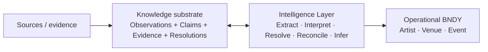

The Intelligence Layer is **not a datastore**. It is the reasoning/runtime layer between evidence and canonical BNDY projections.

Its responsibilities include:

- deterministic extraction;
- AI interpretation where deterministic methods are insufficient;
- artist and venue identity resolution;
- event candidate clustering;
- source authority evaluation;
- corroboration;
- contradiction handling;
- cancellation and reinstatement reasoning;
- bounded graph expansion;
- source reliability analysis;
- exception-only escalation.

---

## 3. Where the graph is

The graph exists **logically from the moment BNDY stores connected Claims, Candidates, Resolutions and canonical entities**.

Neptune is not required to make the model a graph.

### Phase 1 — graph-shaped knowledge in DynamoDB

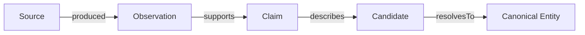

Initially, the relationships are persisted in DynamoDB/S3 because that is cheap, operationally simple and sufficient for the first reconciliation workloads.

### Phase 2 — graph projection into Neptune

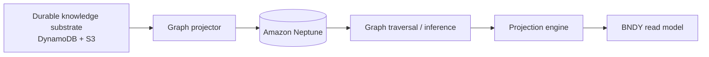

**Important:** Neptune is initially a **graph projection/index**, not the only copy of truth.

The durable substrate remains:

- immutable Observations;
- Claims;
- Resolutions;
- Evidence Packs;
- Tombstones / withdrawals;
- raw evidence in S3.

---

## 4. Example: three sources, one gig

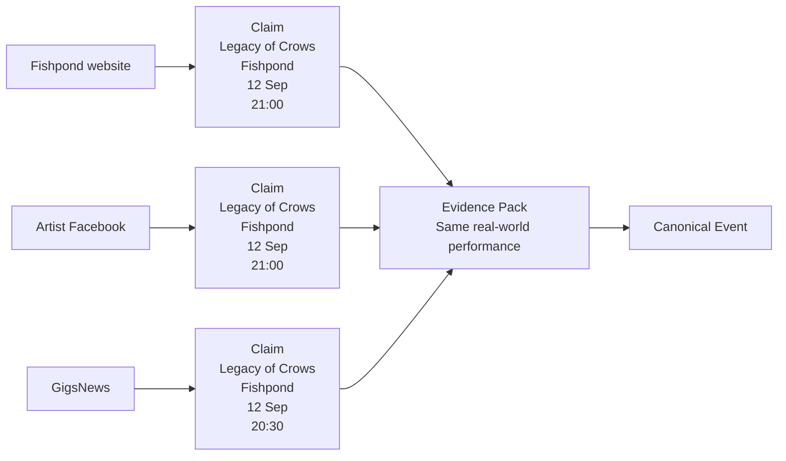

The graph retains all three claims.

The Intelligence Layer can reason:

```text
Venue-owned source: 21:00
Artist-owned source: 21:00
Curated source:      20:30

Projection: 21:00
Reason: two higher-authority owned sources agree.
```

The `20:30` claim is **not deleted**. It remains provenance and disagreement evidence.

---

## 5. Example: cancellation reasoning

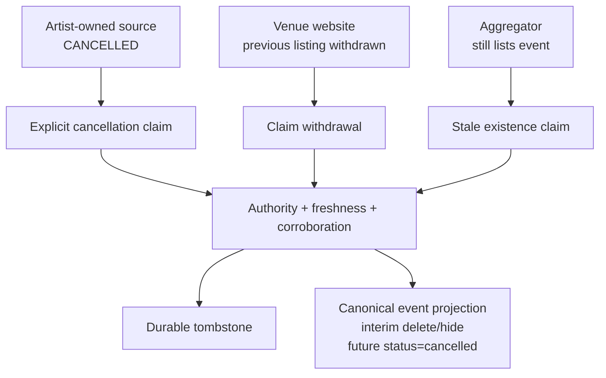

The graph allows BNDY to distinguish:

- explicit cancellation;
- source disappearance;
- stale third-party listings;
- later reinstatement.

---

## 6. What AI makes newly practical

These capabilities are either impossible or uneconomic with traditional deterministic ETL alone.

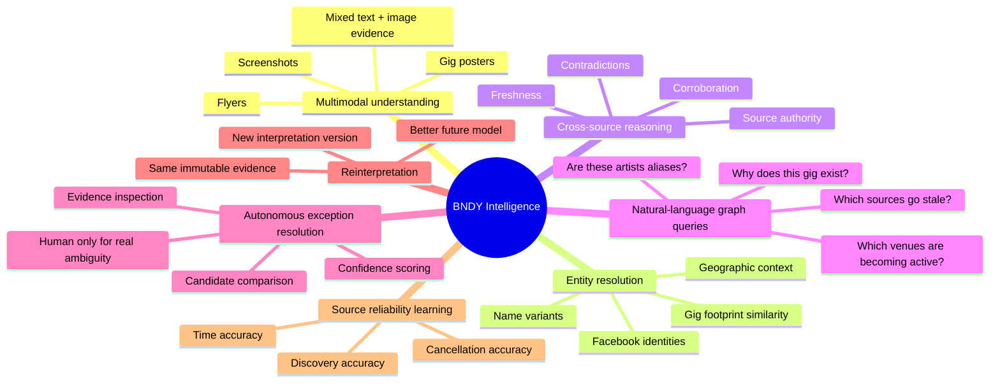

### Practical AI-native use cases

#### Multimodal evidence understanding

A poster image can become structured claims about:

- artist;
- event name;
- physical venue;
- date;
- stage time;
- admission;
- ticket information.

#### Identity from relationship footprint

Two artist names can be inferred as likely aliases using more than string similarity:

```text
name similarity
+ same Facebook identity
+ same region
+ recurring appearance at the same venues
+ overlapping gig dates / promoters
```

#### Contradiction reasoning

BNDY can preserve disagreement rather than flattening source data into last-write-wins.

#### Natural-language interrogation

Future internal queries could include:

```text
Why does BNDY believe this gig exists?

Which Stoke artists have no Facebook URL but share a venue footprint with known originals bands?

Show sources that regularly retain gigs after venue-owned sources cancel them.

Which venues appear to be increasing their grassroots live-music activity over the last six months?

Show unresolved artist candidates that are probably aliases.
```

#### Reinterpretation of historical evidence

Because evidence is immutable, a future model can reinterpret old evidence without rewriting history.

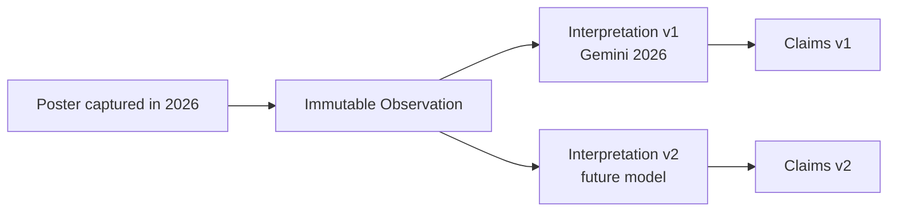

---

## 7. BNDY Graph Explorer

A visual explorer should eventually sit in Godmode/backstage over the knowledge graph.

This is not required for the first AWS source migration, but it is a deliberate future capability.

### Concept

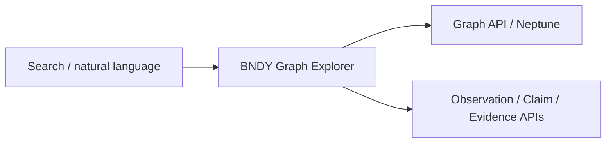

### Example visual neighbourhood

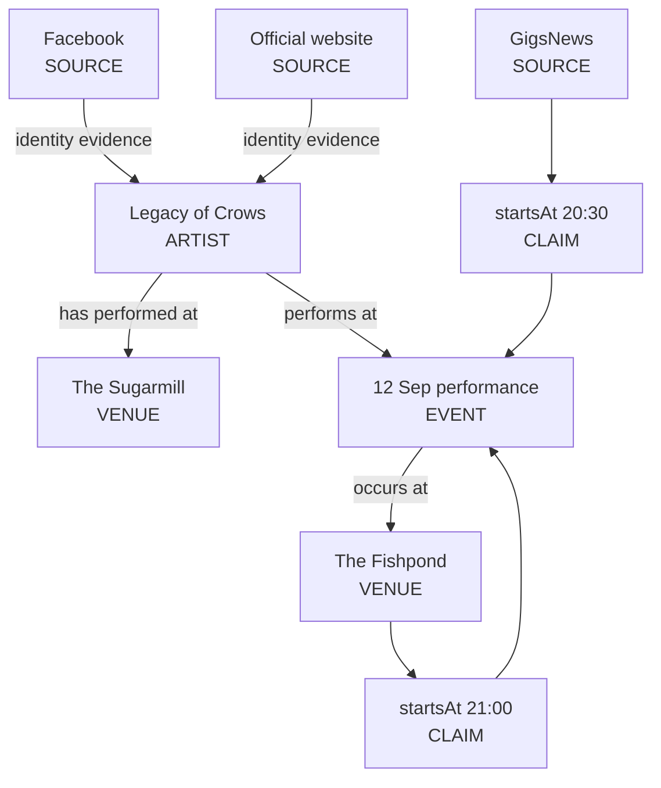

### Interaction model

The explorer should support:

- search any artist, venue, event or source;
- expand one hop / two hops;
- filter by entity type;
- filter by date/freshness;
- show source authority;
- show confidence;
- highlight contradictions;
- show inferred vs directly asserted edges;
- click an edge to inspect the Claim;
- click a Claim to inspect the raw evidence;
- ask natural-language questions about the visible subgraph.

Potential browser visualisation libraries:

```text
Cytoscape.js
Sigma.js
```

The graph API can later be backed by Neptune, while evidence drill-down continues to use the durable DynamoDB/S3 substrate.

---

## 8. Obsidian / local visualisation

Yes: the BNDY graph can be exported for local exploration.

Useful export formats:

```text
Markdown + wikilinks   → Obsidian
GraphML                → Gephi / yEd / Cytoscape
JSON                   → custom tooling
CSV nodes + edges      → general graph analysis
```

Example Obsidian projection:

```markdown
# Legacy of Crows

Type: Artist

## Relationships
- Performs at [[The Fishpond]]
- Performs at [[The Sugarmill]]
- Appears in [[Gig 2026-09-12 Fishpond]]
- Identity supported by [[Facebook Source - Legacy of Crows]]
```

This would be an **export/view**, not the canonical knowledge store.

---

## 9. Product read model vs knowledge graph

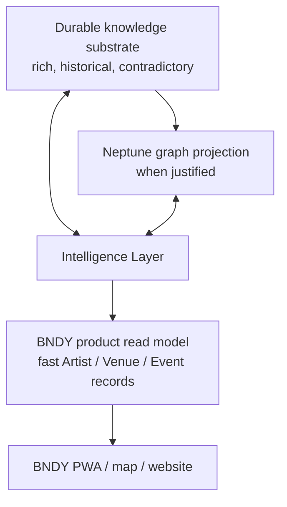

The PWA should **not** perform graph traversals just to render the normal gig map.

The operational database answers:

> What does BNDY currently believe?

The knowledge graph answers:

> Why does BNDY believe it, what disagrees with it, and what else can be inferred?

---

## 10. Build position

The Graph Explorer and Neptune are deliberately **not on the first production critical path**.

The correct sequence is:

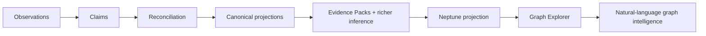

The crucial step is to build **graph-native data contracts now** so that adding Neptune and visualisation later does not require rewriting every source collector.

---

## 11. Architectural principle

> **BNDY is not ultimately a gig-listing database. It is a living, evidence-backed model of the grassroots live-music ecosystem, with Artist, Venue and Event records as operational projections of that knowledge.**
