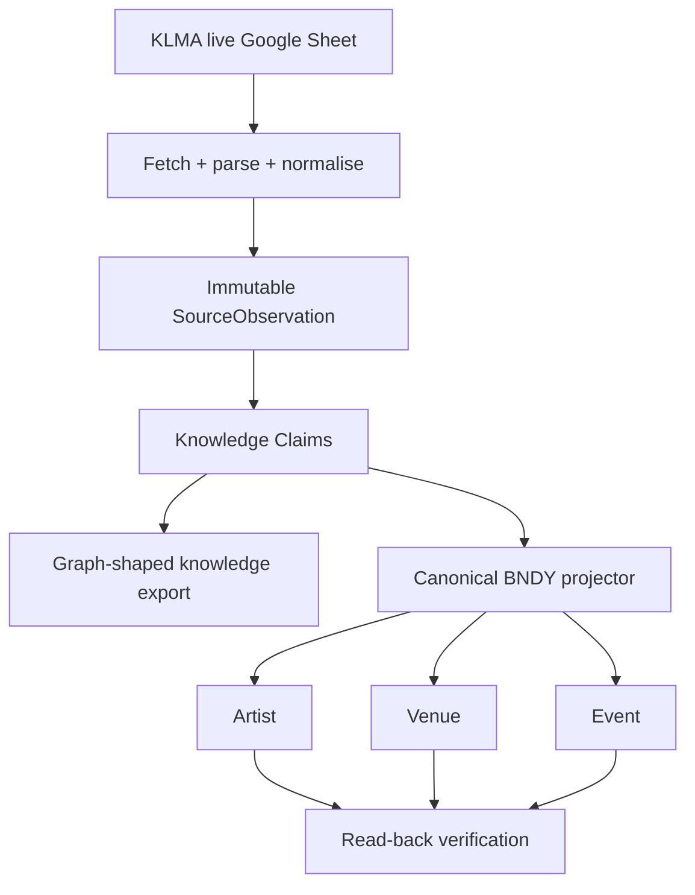

# KLMA Knowledge Vertical Slice

**Purpose:** prove the dual-path target today with one real source before the full scheduled-source infrastructure is complete.

This is an execution slice of `TARGET-ARCHITECTURE.md`, not a competing architecture.

## What it proves



The CLI always creates local run artefacts. AWS persistence and BNDY projection are explicit opt-ins.

## Safety defaults

Running:

```bash
npm run source:klma
```

performs a live source fetch but **does not mutate BNDY** and **does not write AWS knowledge state**.

It creates:

```text
artifacts/knowledge/<run-id>/
  raw.csv
  observation.json
  claims.json
  candidates.json
  graph.json
  graph.html
  run-report.json
```

Open `graph.html` in a browser. Candidate nodes are the graph-shaped knowledge inferred directly from the real KLMA observation.

## Persist the knowledge substrate

Use the already deployed enrichment StateTable and EvidenceBucket:

```bash
STATE_TABLE=<physical-state-table-name> \
EVIDENCE_BUCKET=<physical-evidence-bucket-name> \
npm run source:klma -- --persist-aws
```

This writes:

- the raw CSV to S3 under the source/observation path;
- one immutable `SourceObservation` record;
- each `KnowledgeClaim` once, using the WP-02 single-copy key shape;
- GSI attributes are written now and become queryable when WP-02 adds the indexes.

No BNDY Artist/Venue/Event mutation occurs unless `--apply` is also supplied.

## Project a small real sample into BNDY

Start with a small limit:

```bash
npm run source:klma -- --limit 3 --apply
```

The projector:

1. resolves/creates the Artist via `POST /api/artists/find-or-create`;
2. resolves/creates the Venue via `POST /api/venues/find-or-create`;
3. creates or matches the Event via `POST /api/events/community`;
4. reads the Event back from the canonical API;
5. refuses to count the item successful if read-back does not match Artist, Venue and date.

Existing duplicates are treated as `existing`, not failures.

For a focused test:

```bash
npm run source:klma -- --match "some artist or venue" --limit 3 --apply
```

## Full dual-path demo

When the table/bucket environment values are available:

```bash
STATE_TABLE=<table> \
EVIDENCE_BUCKET=<bucket> \
npm run source:klma -- --limit 3 --persist-aws --apply
```

The same source capture then produces both:

```text
REAL-WORLD EVIDENCE
      │
      ├──> Observation + Claims + graph.html
      │
      └──> canonical BNDY Artist/Venue/Event records
```

Once projection results exist, `graph.html` includes canonical Artist, Venue and Event nodes and `resolvesTo` / `projectsTo` edges, so the graph visibly connects source evidence to the live BNDY records.

## Deliberate limitations of this slice

This is not the scheduled production source runner yet.

It deliberately does not implement:

- EventBridge scheduling;
- source queues / DLQs;
- diff/cancellation inference;
- AuthorityPolicy for destructive writes;
- browser workers;
- multi-source corroboration;
- Neptune.

Those remain in the Build Plan. This slice is additive/create-only projection and therefore avoids destructive reconciliation until WP-05 exists.

The KLMA port is intentionally deterministic. It does not invoke Gemini/Claude.

## Exit criteria

The vertical slice is successful when one run can demonstrate all of the following:

1. a live KLMA capture exists as `raw.csv`;
2. an immutable Observation exists;
3. Claims exist for Artist, Venue, date, time and source provenance;
4. the generated HTML visibly renders those relationships;
5. `--apply` resolves or creates the same Artist/Venue/Event in BNDY;
6. the Event is read back successfully;
7. the graph displays the canonical BNDY IDs alongside the source claims.

After that proof, the code is folded into WP-02/WP-04/WP-07 rather than maintained as a second runner.
